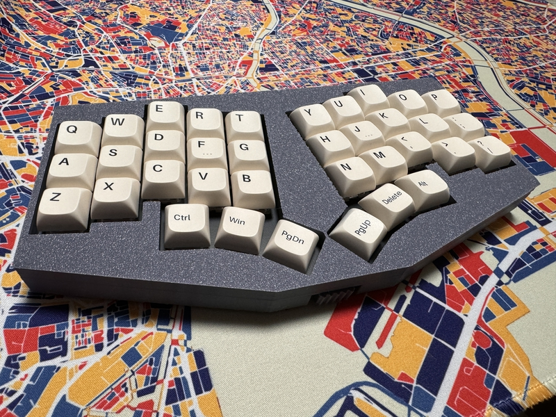

# cool536lcble

## What is cool536lcble?

The cool536lc key layout has been revised to create a 36-key keyboard that can be connected wirelessly via Bluetooth.

 

## firmware

 cool536lc run QMK_firmware,use BLE Micro Pro.

## Parts list

| No. | Patrs | Quantity | remarks | Suppliers | Cost |
|--|--|--|--|--|--|
|番号|名前|数|備考|調達先|参考価格（送料込）| 
|1|PCB|1|36key |[elecrow](https://www.elecrow.com) [JLCPCB](https://jlcpcb.com) [ALLPCB](https://www.allpcb.com)|５枚で20〜30ドル| 
|2|Switch Plate|1||[elecrow](https://www.elecrow.com) [JLCPCB](https://jlcpcb.com) [ALLPCB](https://www.allpcb.com)|５枚で20〜30ドル| 
|3|Ble Micro|1||[遊舎工房](https://shop.yushakobo.jp/products/ble-micro-pro?_pos=1&_sid=c1171a4b2&_ss=r) [のぎすけ屋](https://booth.pm/ja/items/1177319)|4500〜4950円|
|4|ボタン電池ホルダー|1|HU1632|[モノタロウ](https://www.monotaro.com/p/8835/2765/) |263円|
|5|水平スライドスイッチ|1||[遊舎工房](https://shop.yushakobo.jp/products/5624?_pos=1&_sid=f65b70e3c&_ss=r)|110円|
|6|チップ積層セラミックコンデンサー |1|100μF6.3V F 3216|[秋月電子](https://akizukidenshi.com/catalog/g/g102151/)|10個入り200円|
|7|Swith socket スイッチソケット|36|cherry MX互換|[遊舎工房](https://yushakobo.jp) [Talp Keyboard](https://talpkeyboard.net) [Daily Craft Keyboard](https://shop.dailycraft.jp)等|10個で187円程度|
|8|Diode ダイオード|36|リードタイプでもSMDでも可|[遊舎工房](https://yushakobo.jp) [Talp Keyboard](https://talpkeyboard.net) [Daily Craft Keyboard](https://shop.dailycraft.jp)等|100個で220円程度から|
|9|TopCase|1|3D Print|||
|10|BottomCase|1|3D Print||
|11|Switch Parts|1|3D Print||

In addition, you will need a USB cable, keycaps, etc.
 
この他に、USBケーブル、キーキャップ等が必要です。
 
