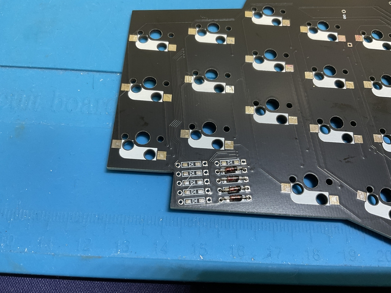
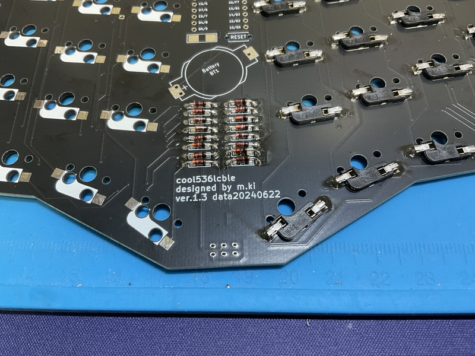
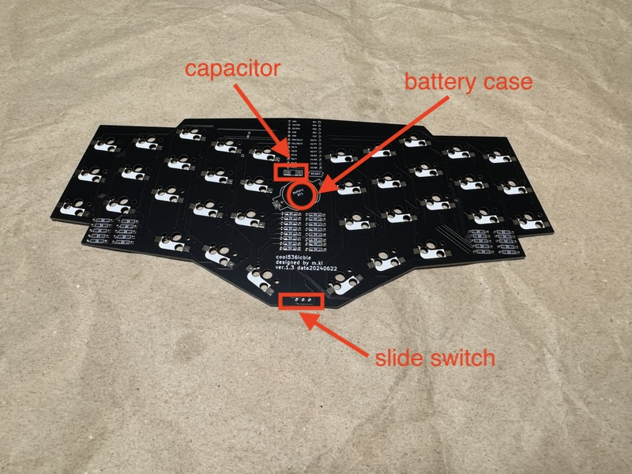
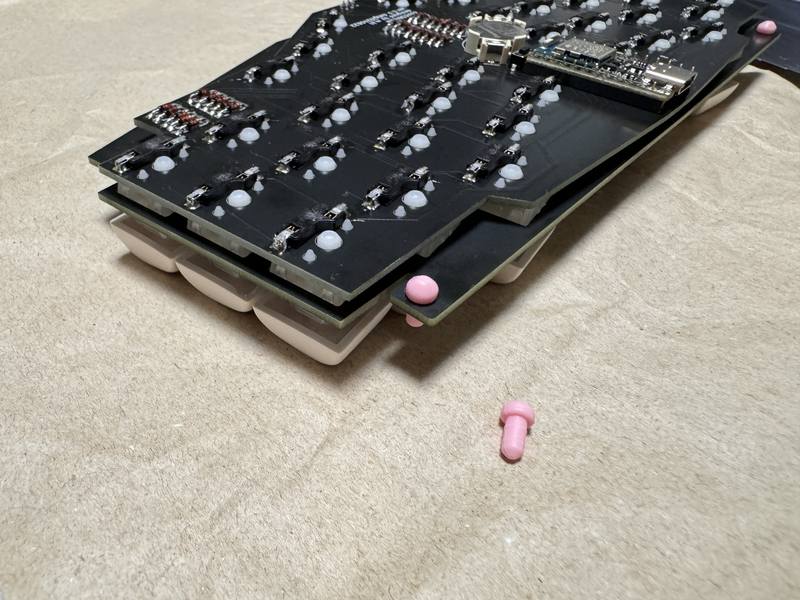
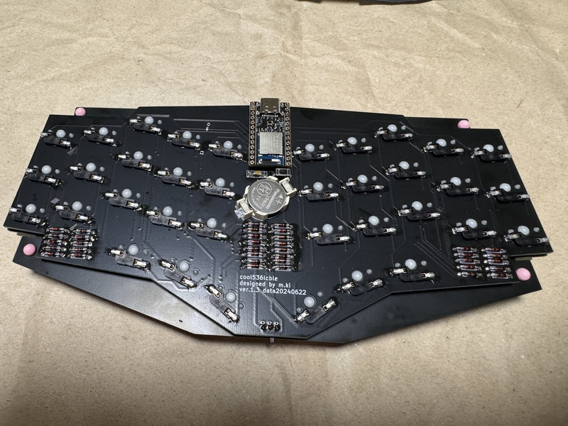
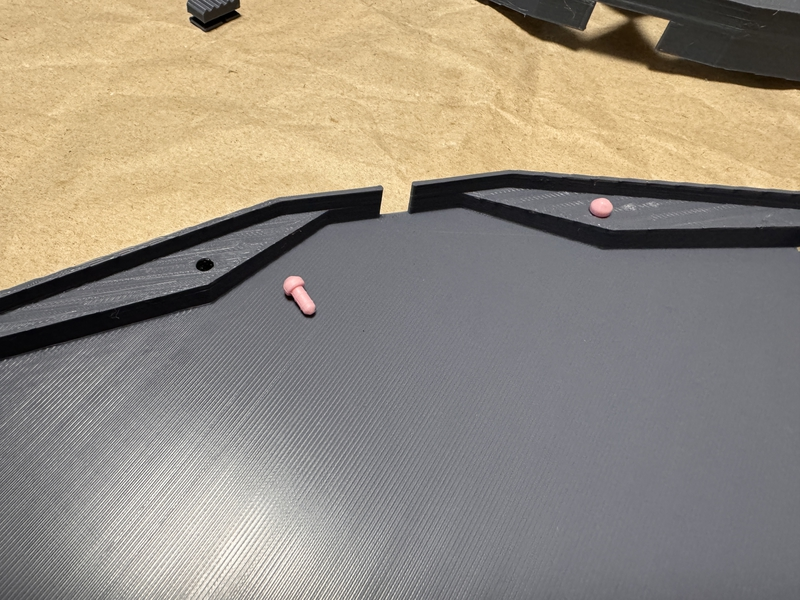
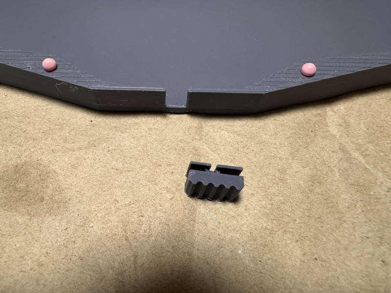
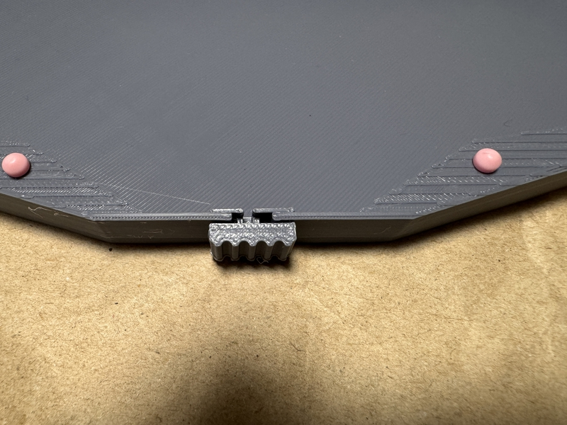
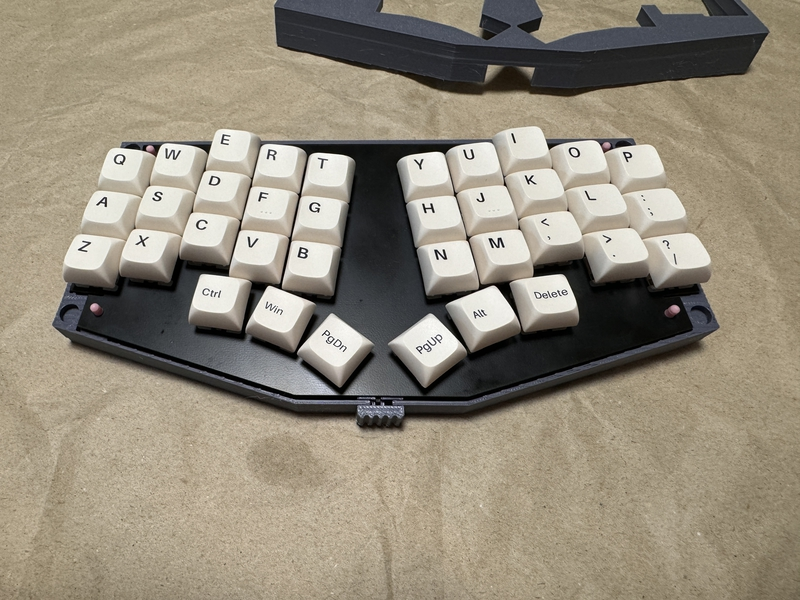
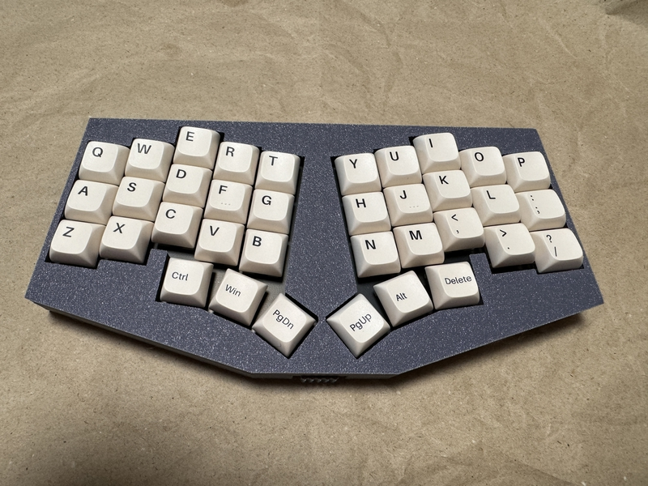

## Build guide

## Build 1

### 1 Diode soldering

Solder the diodes to the back of PCB.
 
PCBの裏面にダイオードのハンダ付けをします。
 
There are lead type and SMD diodes.
 
ダイオードはリードタイプか、SMDがあります。
 
Here, we will explain the lead type soldering.
 
ここでは、リードタイプのハンダ付けの説明をします。
 

Use a lead bender to bend the legs of the diode.
 
リードベンダーを使い、ダイオードの足を曲げます。
 
Insert the diode into the board.
 
ダイオードを基板に挿しこみます。
 

Please pay attention to the orientation of the diode.
 
ダイオードの向きに注意してください。
 

Secure the diode with masking tape, then face up.
 
マスキングテープでダイオードを固定してから、表面を上にします。
 
Solder the protruding legs.
 
はみ出ている足部分に、ハンダ付けをします。
 
After soldering, use nippers to cut off the protruding legs.
 
はんだ付けが終わったら、はみ出ている足をニッパーで切り取ってください。
 

[８倍速　Diodeハンダ付け動画](https://youtu.be/Yaodh2-XxV4)

 
 

### 2 Soldering switch sockets

Solder the switch sockets on the back side.
 
裏面にスイッチソケットのハンダ付けをします。
 

[８倍速　Switch socketハンダ付け動画](https://youtu.be/E__mHvmIXQo)

  

### 3 Soldering the capacitor

Solder the [capacitor](https://akizukidenshi.com/catalog/g/gP-02151/).
 
[コンデンサー](https://akizukidenshi.com/catalog/g/gP-02151/)をハンダ付けします。
 

First, apply solder to the terminal on one side. Then, place the capacitor, melt the solder, and fix it.
 
最初に、片側の端子にハンダを盛ります。そして、コンデサーを置き、ハンダを溶かして、固定します。
 

Next, melt and pour solder into the other terminal and attach the capacitor. Please fix it.
 
次に、もう片側の端子にハンダを溶かして、流し込んで、コンデンサーを。固定してください。
 
 

### 4 Soldering the slide switch

Insert the [slide switch](https://shop.yushakobo.jp/products/5624?variant=45044666007783) from the back side of the PCB and solder the front side. Please remove the protruding legs.
 
[スライドスイッチ](https://shop.yushakobo.jp/products/5624?variant=45044666007783)はPCBの裏面から挿入して、表面をハンダ付けします。はみ出た足は、切り取ってください。
 

### 5 Soldering the battery case

[Battery box](https://www.monotaro.com/p/8835/2765/) is inserted from the back of the PCB and soldered on the front side. The protruding legs. Please cut it out.
 
[電池ボックス](https://www.monotaro.com/p/8835/2765/)は、PCB裏面から挿入して、表面をハンダ付けします。はみ出た足は。切り取ってください。

### 6 (Option) Solering the reset switch

Actually, it's not necessary. If you are an cool536lcble and are trying to install a WPRO microw without buying a Ble Micro Pro, you will need a reset switch.
 

実は必要ありません。もし、あなたが cool536lcbleなのに、Ble Micro Proをおごることをせずに、ただのpro micro取り付けようとするならば、リセットスイッチは必要でしょうね。
 

### 7 Ble Micro Pro

Please prepare [Ble Micor Pro](https://shop.yushakobo.jp/products/ble-micro-pro?_pos=1&_sid=192f46387&_ss=r).
 
[Ble Micor Pro](https://shop.yushakobo.jp/products/ble-micro-pro?_pos=1&_sid=192f46387&_ss=r)を用意してください。
 

If it is a 12-pin con-through, install it as shown in the image. Then insert the Ble Micro Pro.

12ピンコンスルーであれば、画像のように、取り付けてください。そして、Ble Micro Proを挿入してください。
 

### 8 Please insert the batteries.

Insert the CR1632 battery into the battery box.
 
CR1632電池を電池ボックスに挿入してください。
 

### 9 Firmware

The explanation is posted [here](https://sizu.me/m_ki/posts/x1mh846sx3zd).

 

[ここ](https://sizu.me/m_ki/posts/x1mh846sx3zd)に説明を載せています。
  

"6 Installing QMK_Firmware on Ble Micro pro" from [this site](https://github.com/telzo2000/cool836qalble/blob/main/build_guide_cool836qalble.md). please refer.
 
[このサイト](https://github.com/telzo2000/cool836qalble/blob/main/build_guide_cool836qalble.md)の「6 Instorlling QMK＿Firmware on Ble Micro pro」を。参考にしてください。
 

### Build 2(case)

### 1 Case

Fix the [magnets](https://www.amazon.co.jp/gp/product/B09B7BSXC4/ref=ppx_yo_dt_b_asin_title_o02_s00?ie=UTF8&th=1) to the five dents inside the case with an adhesive or the like. There are 4 in the top case and 4 in the bottom case for a total of 8.Please pay attention to the polarity of the magnet. Make sure the top case and bottom case are magnetically attached.
 
ケースの内側にある４つの凹みに[磁石](https://www.amazon.co.jp/gp/product/B09B7BSXC4/ref=ppx_yo_dt_b_asin_title_o02_s00?ie=UTF8&th=1)を接着剤などで固定します。トップケースに４箇所、ボトムケースに４箇所の合計８箇所です。
極性に注意してください。トップケースとボトムケースが磁力で付くようにしてください。
 
 
Due to the characteristics of 3D printed matter, the top case and bottom case may be able to interlock and be fixed without using magnets.
 
3Dプリンタでの印刷物の特性上、磁石を付けなくても、トップケースとボトムケースが噛み合わさり、固定できることがあります。
 
 

Insert the 4 Tadpoles into the 4 locations on the switch plate from below. Also, insert two Tadpoles into the bottom case from above in two places.
 
Tadpole４個をスイッチプレートの４箇所に、下から差し込みます。また、Tadpole２個を、ボトムケースの２箇所に上から差し込みます。

 
 
Insert the switch knob into the recessed part in front of the bottom case.
 
ボトムケース手前の凹部分に、スイッチノブを挟みます。

 
 
Insert the switch plate and PCB between the top case and bottom case, secure them with magnets, and you're done.
 
トップケースとボトムケースの間にスイッチプレートとPCBを挟み込むように入れて、磁石で固定すれば完成です。

 

Welcome to the world of 36 keys.
 
36キーの世界へようこそ。
 
